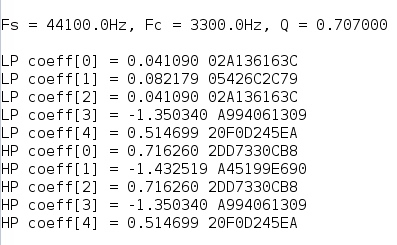

# FPGA_STEREO_CROSSOVER

* ESP32 reads .wav / .mp3 files on a micro-SD card and generates I2S digital stereo audio stream (16-bit, 44.1kHz or 48kHz) as
a master driving MCK, BCK and WS clocks.
* FPGA implements an I2S slave interface and stereo 2-way crossover filters. It generates two I2S data output streams that drive low-pass and 
high-pass channels on two TAS5753MD stereo I2S power amplifiers. 
* FPGA audio processing modules are clocked by the external MCK. Slave SPI interface and coefficient loading use the system clock 50MHz.
* Implemented in VHDL on Altera Cyclone IV EP4CE6E22. I increased the filter coefficient precision from 2.30 to 2.38 as I want to
be able to use the crossover biquad filters at lower frequencies e.g. 300Hz (sub-woofer crossover). 
In this case some of the filter coefficients can be small 
and will benefit from the increased fractional resolution. 
As a result, the FPGA embedded multiplier usage has gone up from 63% to 100%. Ah well.

Crossover coefficients @ fs=44100Hz, fc=3300Hz, Q=0.707

Crossover coefficients @ fs=44100Hz, fc=330Hz, Q=0.707

FPGA resource utilization with 2.38 coefficients

* ESP32 calculates the biquad filter coefficients based on the sample-rate of the audio file being played and loads
the filter coefficients via an SPI interface to the FPGA.

# Software development platform

* Intel Quartus Prime Lite 19.1
* Arduino 1.8.13 with arduino-ESP32 1.04 package
* Ubuntu 20.04 amdx64 

# Constraints

* The FPGA modules can handle I2S 16bit or 24bit, sample rate 44.1kHz or 48kHz. The ESP32 code currently can only
handle 16bit wav/mp3 files.
* Two-way crossover frequency = 3300Hz, filter Q = 0.707 (Butterworth)

# Credits

* [FPGA Biquad IIR Filters](https://www.youtube.com/watch?v=eE6Qwv997cs)
* [ESP32 SD I2S Audio](https://github.com/schreibfaul1/ESP32-audioI2S)

# Prototype

Top side of prototype board 
* ESP32 breakout board
* Micro-SD breakout board
* Rotary encoder for volume control
* 5V dc-dc converter and 3.3V LDO regulator module
* Stacked TAS5753MD I2S power amplifiers
* Testing now with a 19.5V@4.7A laptop power supply. The TAS5753MD power amplifier is rated for 26V, and the 
DC-DC converter can handle input voltages up to 32V.

Bottom side of prototype board 
* Waveshare Core EP4CE6 FPGA development board.

The mid-woofers and tweeters are driven by the TAS5753MD amplifiers. The (sub)woofers are disconnected.

