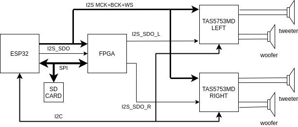
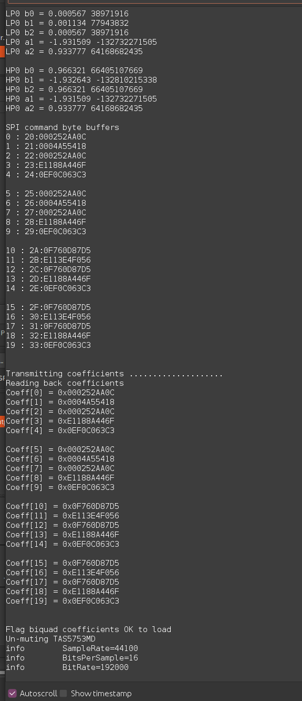

# FPGA_STEREO_CROSSOVER

* ESP32 reads .wav / .mp3 files on a micro-SD card and generates a I2S digital stereo audio stream (16-bit, 44.1kHz or 48kHz) as
a master driving MCK, BCK and WS clocks.
* FPGA implements an I2S slave interface and stereo 2-way crossover filters. It generates two I2S data output streams that drive low-pass and 
high-pass channels on two TAS5753MD stereo I2S power amplifiers. 
* Implemented in VHDL on Altera Cyclone IV EP4CE6E22 (WaveShare Cyclone CoreEP4CE6 board)
* Implemented in Verilog on Anlogic EG4S20BG256 (Sipeed Tang Primer board).
* Crossover filters are 4th order Linkwitz-Riley, implemented as cascaded identical 2nd order Butterworth filters. For Linkwitz-Riley filters, the
sum of the low pass and high pass outputs is flat across the crossover frequency.
* The cascaded filters do not have to be identical. There is memory storage for four unique biquad filters, wo we can implement
equalization if necessary.
* Using Octave to get the 2nd order butterworth filter coefficients

 

* Implementation in direct form I to avoid overflow issues, at cost of more delay element memory usage.

* FPGA audio processing modules are clocked by the external MCK from the ESP32 board. This will vary depending on the audio source sample rate and data packaging. 
* Top level, slave SPI interface and coefficient loader modules use the on-board system clock (50MHz for the Waveshare Cyclone IV board, 24MHz for the Sipeed Tang Primer).
* Audio samples are max 24bits. The I2S receiver can handle 16/16 and 24/32 bit packaging.
* Filter coefficients are 40bit (4.36) 2's complement. The 4 integer bits give us some headroom for equalization, and I want to
be able to use the crossover filters at lower Fc/Fs values, e.g. for a sub-woofer crossover at ~300Hz. 
In this case some of the filter coefficients are small enough to benefit from the 36bits of fractional resolution.

* Altera Cyclone IV EP4CE6 resource usage

* Anlogic EG4S20 resource usage

* ESP32 calculates the biquad filter coefficients based on the sample-rate of the audio file being played and updates
the FPGA via an SPI interface.

# Software development platform

* Intel Quartus Prime Lite 19.1 (Linux), for Altera FPGA
* Anlogic Tang Dynasty 4.6.2 64-bit (Linux), for Anlogic FPGA
* Arduino 1.8.13 with arduino-ESP32 1.04 package
* Ubuntu 20.04 amdx64 

# Constraints

* The FPGA modules can handle I2S 16/16 or 24/32 data packaging, with sample rate 44.1kHz or 48kHz. 
The ESP32 code currently only reads wav/mp3 files encoded with 16bit data at 44.1kHz or 48kHz.

# Credits

* [FPGA Biquad IIR Filters](https://www.youtube.com/watch?v=eE6Qwv997cs)
* [ESP32 SD I2S Audio](https://github.com/schreibfaul1/ESP32-audioI2S)
* [Cascaded Biquad filter coefficient calculation](https://github.com/igorinov/biquad)

# Useful links

* [IIR filter design](https://www.dsprelated.com/showarticle/1137.php)
* [Biquad implementation](https://dspguru.com/dsp/howtos/implement-iir-filters/)
* [Biquad filter formulae](https://www.earlevel.com/main/2011/01/02/biquad-formulas/)
* [Cascaded biquad filters](https://igorinov.com/dsp/biquad/)

# Prototype

Top side of prototype board 
* ESP32 breakout board
* Micro-SD breakout board
* Rotary encoder for volume control
* Stacked TAS5753MD I2S power amplifiers
* Tested with a 19.5V 4.7A laptop power supply. The TAS5753MD power amplifier is rated for 26V.

Bottom side of prototype board 
* Waveshare Core EP4CE6 FPGA development board.
* 5V output dc-dc converter (5V supply for FPGA board, max 24V input)
* 3.3V AMS1117 LDO voltage regulator (3.3V supply for micro-SD and TAS5753MD)

When testing the crossover at Fc=3400Hz, the sub-woofers are disconnected. The TAS5753MD amplifiers drive the mid-woofers and tweeters.

When testing the crossover at Fc=340Hz, I use a passive LC crossover circuit to drive the
mid-woofer and tweeters. The TAS5753MD amplifiers drive the sub-woofers and LC crossover inputs.

