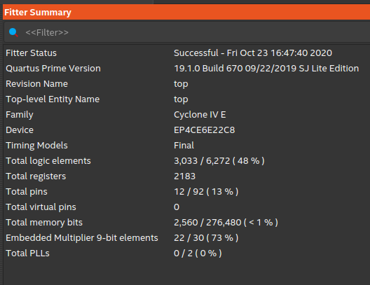

# FPGA_STEREO_CROSSOVER

* Stereo digital 2-way crossover filters implemented on FPGA, processing an I2S stereo audio stream. 
* ESP32 reads .wav / .mp3 files on a micro-SD card and generates I2S digital stereo audio stream (16-bit, 44.1kHz or 48kHz).  
* FPGA I2S module is a slave, i.e. it is driven by external MCLK, BCK and WS clocks. The audio processing modules are clocked by MCK.
* Implemented in VHDL on Altera Cyclone IV EP4CE6E22

* ESP32 dynamically updates biquad IIR filter coefficients via SPI interface to FPGA.
* FPGA outputs dual I2S data streams, one for left channel and one for right channel. Low-pass filtered data on WS=0, High-pass filtered data on WS=1.
* Dual TI TAS5753MD I2S stereo power amplifier boards. Each processes a single channel (L or R)  low-pass-filtered and high-pass-filtered data.

# Development platform

* Quartus Prime Lite 19.1
* ESP32-Arduino 1.04 package, Arduino 1.8.13
* Ubuntu 20.04 amdx64 

# Constraints

* I2S 16bit or 24bit, sample rate 44.1kHz or 48kHz. 
* Two-way crossover frequency = 3300Hz, filter Q = 0.707 (Butterworth)

# Credits

* [FPGA Biquad IIR Filters](https://www.youtube.com/watch?v=eE6Qwv997cs)
* [ESP32 SD I2S Audio](https://github.com/schreibfaul1/ESP32-audioI2S)

# Prototype

Top side of prototype board 
* ESP32 breakout board
* Micro-SD breakout board
* Rotary encoder for volume control
* 5V dc-dc converter and 3.3V LDO regulator module
* Stacked TAS5753MD I2S power amplifiers
* Now connected to 12V@3A power supply brick, but the DC-DC converter and TAS5753MD power amplifiers can handle up to 30V.

Bottom side of prototype board 
* Waveshare Core EP4CE6 development board.

The mid-woofers and tweeters are driven by the dual TAS5753MD amplifiers. The (sub)woofers are disconnected.

