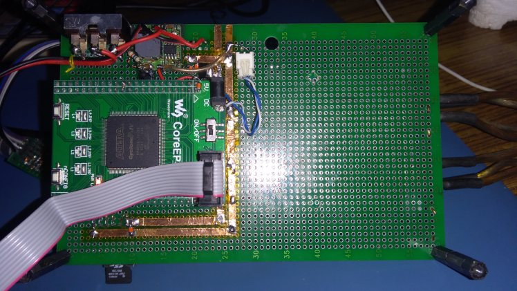

# FPGA_STEREO_CROSSOVER

* Stereo digital 2-way crossover filters implemented on FPGA, processing I2S stereo audio stream. 
* Driven by ESP32 generating I2S digital audio stream with input from .wav / .mp3 files on a micro-SD card.  
* The FPGA I2S module is a slave, i.e. it is driven by external MCLK, BCK and WS clocks. The audio processing modules are clocked by MCK.
* FPGA processing implemented on Altera Cyclone IV FPGA EP4CE6E22
* Biquad IIR filter coefficients dynamically updated via slave SPI interface on FPGA connected to ESP32
* FPGA outputs dual I2S data streams, one for left channel and one for right channel. Low-pass on WS=0, High-pass on WS=1
* Dual TI TAS5753MD stereo I2s power amplifier boards, each processing a single channel (L or R)  low-pass-filtered and high-pass-filtered data.

# Development platform

* Quartus Prime Lite 19.1 on Ubuntu 20.04 amdx64
* Arduino ESP32 1.04

# Data constraints

* I2S 16bit or 24bit, sample rate 44.1kHz or 48kHz. 
* Two-way crossover frequency of 3300Hz with Q = 0.707 (Butterworth)

# Prototype

# Credits
* [FPGA Biquad IIR Filters](https://www.youtube.com/watch?v=eE6Qwv997cs)
* [ESP32 SD I2S Audio](https://github.com/schreibfaul1/ESP32-audioI2S)

