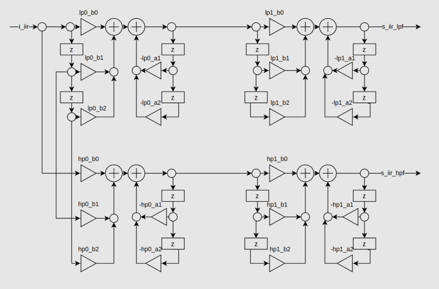
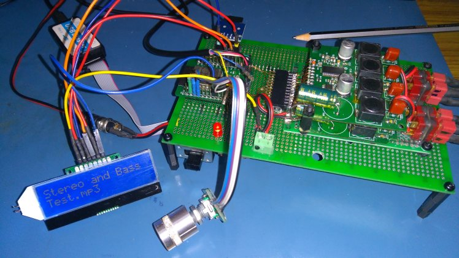

# FPGA_STEREO_CROSSOVER

* ESP32 reads .wav / .mp3 files on a micro-SD card and generates a I2S digital stereo audio stream (16-bit, 44.1kHz or 48kHz) as
a master driving MCK, BCK and WS clocks.
* FPGA implements an I2S slave interface and stereo 2-way crossover filters. It generates two I2S data output streams that drive low-pass and 
high-pass channels on two TAS5753MD stereo I2S power amplifiers. 
* Crossover filters are 4th order Linkwitz-Riley, implemented as cascaded identical 2nd order Butterworth filters.

* Using Octave to get the 2nd order butterworth filter coefficients

 

* Implementation in direct form I to avoid overflow issues, at cost of more delay element memory usage.

* FPGA audio processing modules are clocked by the external MCK. Slave SPI interface and coefficient loader modules use the on-board
system clock.
* Implemented in VHDL on Altera Cyclone IV EP4CE6E22 (WaveShare Cyclone IV board), and in Verilog on Anlogic EG4S20BG256 (Sipeed Tang Primer board).
* I increased the filter coefficient precision from 2.30 to 2.38 as I want to
be able to use the crossover filters at lower Fc/Fs values, e.g. for a sub-woofer crossover at ~300Hz. 
In this case some of the filter coefficients are small enough to cause filter instability due to fixed-point arithmetic coefficient quantization issues, so require increased fractional resolution.

* ESP32 calculates the biquad filter coefficients based on the sample-rate of the audio file being played and loads
the filter coefficients via an SPI interface to the FPGA.

# Software development platform

* Intel Quartus Prime Lite 19.1 (Linux), for Altera FPGA
* Anlogic Tang Dynasty 4.6.2 64-bit (Linux), for Anlogic FPGA
* Arduino 1.8.13 with arduino-ESP32 1.04 package
* Ubuntu 20.04 amdx64 

# Constraints

* The FPGA modules can handle I2S 16/16 or 24/32 data packaging, with sample rate 44.1kHz or 48kHz. 
The ESP32 code currently only reads wav/mp3 files encoded with 16bit data at 44.1kHz or 48kHz.

# Credits

* [FPGA Biquad IIR Filters](https://www.youtube.com/watch?v=eE6Qwv997cs)
* [ESP32 SD I2S Audio](https://github.com/schreibfaul1/ESP32-audioI2S)

# Useful links

* [IIR filter design](https://www.dsprelated.com/showarticle/1137.php)
* [Biquad implementation](https://dspguru.com/dsp/howtos/implement-iir-filters/)
* [Biquad filter formulae](https://www.earlevel.com/main/2011/01/02/biquad-formulas/)

# Prototype

Top side of prototype board 
* ESP32 breakout board
* Micro-SD breakout board
* Rotary encoder for volume control
* 5V dc-dc converter and 3.3V LDO regulator module
* Stacked TAS5753MD I2S power amplifiers
* Testing now with a 19.5V 4.7A laptop power supply. The TAS5753MD power amplifier is rated for 26V, and the 
DC-DC converter can handle input voltages up to 32V.

Bottom side of prototype board 
* Waveshare Core EP4CE6 FPGA development board.

When testing the crossover at Fc=3400Hz, the sub-woofers are disconnected. The TAS5753MD amplifiers drive the mid-woofers and tweeters.

When testing the crossover at Fc=330Hz, I use a passive LC crossover circuit to drive the
mid-woofer and tweeters. The TAS5753MD amplifiers drive the sub-woofers and LC crossover inputs.

